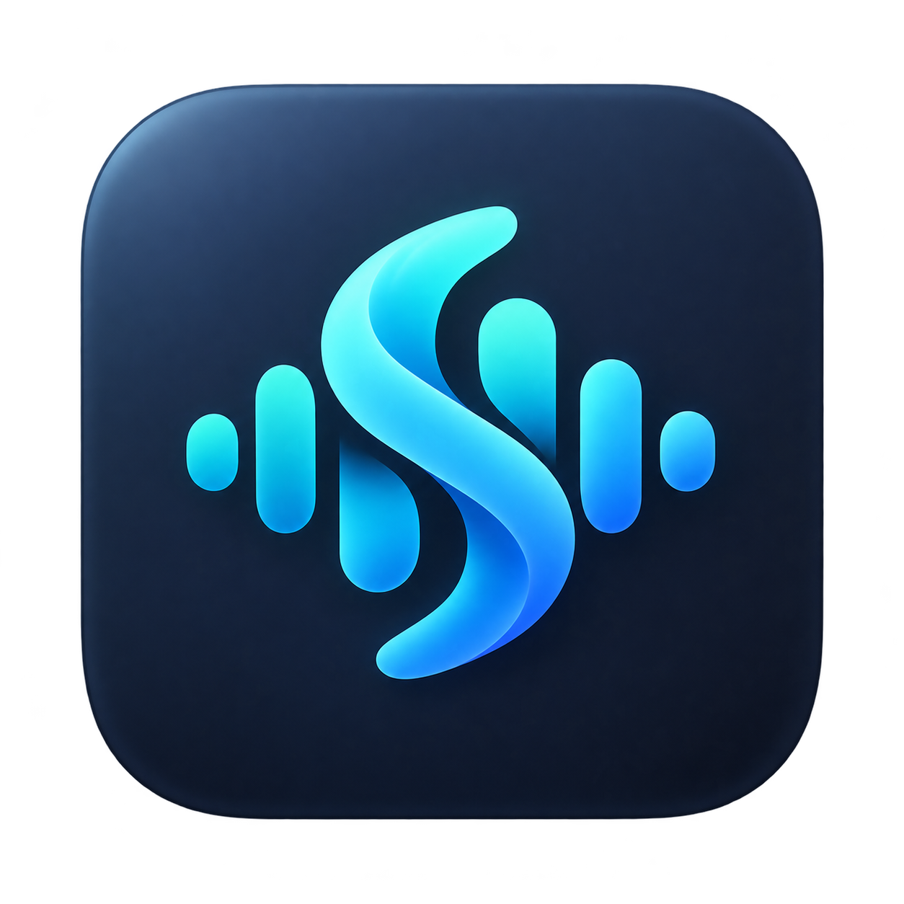

# SpeedyWhisper

<p align="center"></p>

A small, local macOS dictation app: speak, review, and press Enter to paste.

**Built on [AudioWhisper by mazdak and contributors](https://github.com/mazdak/AudioWhisper).** The original [MIT license](LICENSE) is preserved. See [Credits](CREDITS.md).

## Daily use

- Start dictation with your existing hotkey or press-and-hold shortcut.
- A small floating orb appears immediately. Its ring and meter follow the actual microphone level.
- Stop recording. The bar expands into a transcript preview.
- Press **Enter** or click **Paste** to insert into the app you were using. **Copy** remains available; **Escape** dismisses the preview or cancels recording.
- History, recording preferences, and launch at login live in a compact settings window.

Paste requires macOS Accessibility permission. Transcripts are copied to the clipboard as a fallback. The app waits for the captured application to activate before sending the paste command; it never chooses an arbitrary replacement app.

## This fork

SpeedyWhisper uses the existing local **Parakeet v2** installation on Apple Silicon. It removes cloud transcription, WhisperKit, semantic correction, statistics, app categories, and model setup screens. File transcription, completion sounds, and microphone boosting remain.

This is a personal build for an established AudioWhisper installation. It expects the existing cached `mlx-community/parakeet-tdt-0.6b-v2` model and app-managed Python environment. It does not include a new model-download wizard. macOS 14 or newer is required.

The original bundle identifier and application-support paths remain in use to preserve history, preferences, and runtime compatibility. Current upgrades retain the established `/Applications/AudioWhisper.app` installation path while displaying SpeedyWhisper in the interface.

## Build

```sh
swift build
swift test
CODE_SIGN_IDENTITY=- scripts/build.sh
```

The release script produces `SpeedyWhisper.app`. An installed `uv` executable or a copy in `Sources/Resources/bin/uv` is needed for runtime packaging. The existing Python dependency manifest is deliberately preserved; removing unused packages from the live environment is a separate change.

See [the interface notes](SPEEDYWHISPER.md), [the reduction scope](SLIM_BUILD.md), and [the logo source and generation prompt](docs/branding/logo-prompt.md).
