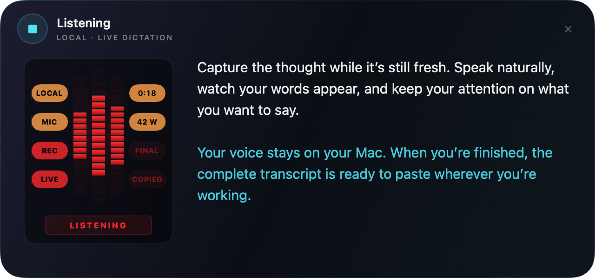
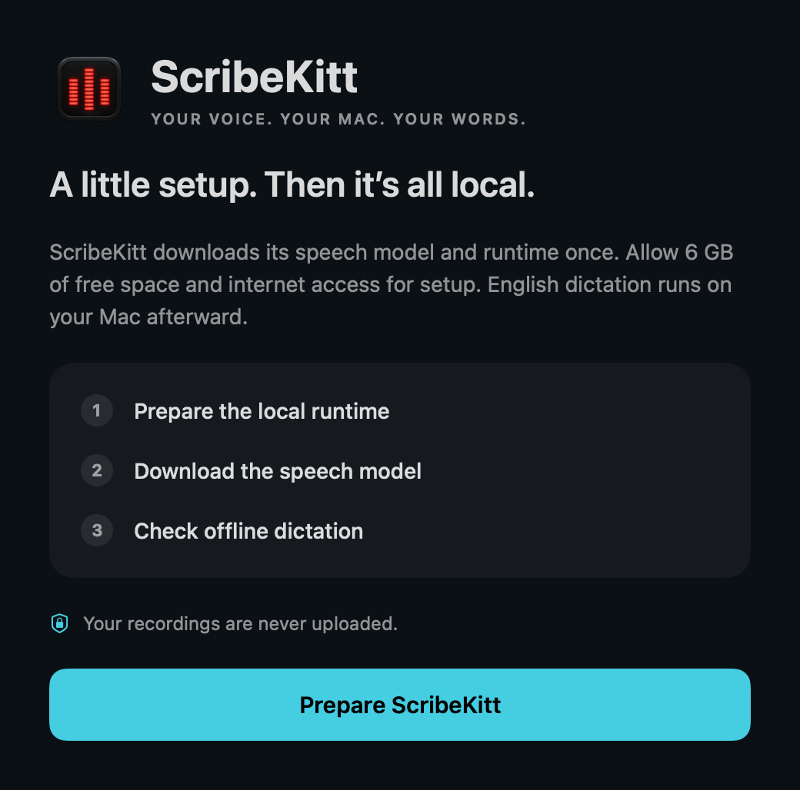

# ScribeKitt

<p align="center"></p>

**Your voice. Your Mac. Your words.**

Local macOS dictation with a KITT-inspired voice display: watch your words appear while you speak, then paste with ⌘V.

<p align="center"></p>
<p align="center"><em>The native recorder interface with sample text. Live words appear beside the voice display; the panel expands for longer dictations.</em></p>

**Built on [AudioWhisper by mazdak and contributors](https://github.com/mazdak/AudioWhisper).** The original [MIT license](LICENSE) is preserved. See [Credits](CREDITS.md).

## Daily use

- Start dictation with your existing hotkey or press-and-hold shortcut.
- A centered floating recorder places a tall KITT-style voice display and decorative status lamps beside the transcript. The text area grows as you speak; earlier words remain visible as the live draft advances.
- Stop recording. The existing full-audio Parakeet pass produces the final text, copies it, and shows a brief animated confirmation that dismisses itself. **Add Trailing Space** is on by default: copied text ending in a full stop, question mark, or exclamation mark gets a trailing space so the next dictation stays separated. You can switch this off in Preferences.
- The completed text is copied to your clipboard. Press **⌘V** yourself wherever you want to paste. **Escape** cancels recording.
- History, recording preferences, and launch at login live in a compact settings window. Launch at login is opt-in for new users and follows the actual macOS setting.

Recording, live text, and manual paste require no Accessibility setup. Auto-hide on the ⌘V shortcut also works when macOS allows the existing global keyboard listener; otherwise the brief timed dismissal remains. The app never sends paste keystrokes. Turn **Transcription Streaming** off in Preferences to use record-then-transcribe without live audio processing. The setting is saved and applies to the next recording.

## First launch

ScribeKitt requires an **Apple Silicon Mac (M1 or newer)** and macOS 14 or later. The current model supports **English dictation**.

1. Move `ScribeKitt.app` to Applications and open it.
2. Choose **Prepare ScribeKitt**. Setup prepares Python, downloads the roughly 2.5 GB Parakeet v2 model, and checks offline loading. Allow 6 GB of free space and an internet connection for setup.
3. Choose **Start dictating**, grant microphone access when prompted, and try a short sentence. Stop, then paste with **⌘V**.

Existing installations with the model and runtime already present skip setup. If a download is interrupted, reopen the app and choose **Prepare ScribeKitt** to retry; completed cached files are reused. Normal model loading and transcription use the local snapshot without online metadata requests.

<details>
<summary>Preview the first-run setup</summary>



</details>

## This fork

ScribeKitt focuses on local **Parakeet v2** dictation, live text, and a compact history. File transcription, completion sounds, and microphone boosting are included. It keeps the original project's license and credits.

When upgrading from AudioWhisper or SpeedyWhisper, quit the previous app and replace it. Existing preferences, runtime, and cached models are retained. ScribeKitt uses a dedicated history file at `~/Library/Application Support/AudioWhisper/history.store`; a healthy legacy history is imported automatically with a timestamped backup. The original bundle identifier and support-folder name remain stable. The installed app is `/Applications/ScribeKitt.app`.

## Install the test build

[ScribeKitt 210.16](https://github.com/JordiPosthumus/ScribeKitt/releases/tag/v210.16) is available as a prebuilt test app. No Xcode or Homebrew is needed. Quit any running ScribeKitt/AudioWhisper app, then paste this into Terminal:

```bash
(
  set -e
  installer=$(mktemp -t scribekitt-install)
  trap 'rm -f "$installer"' EXIT
  curl -fsSL https://raw.githubusercontent.com/JordiPosthumus/ScribeKitt/v210.16/scripts/install.sh -o "$installer"
  /bin/bash "$installer" 210.16
)
```

The installer verifies the archive checksum and app signature, backs up an existing ScribeKitt app, installs it, and opens setup. It preserves preferences, history, and model files. Start at Login is optional and initially off for new users. The test build is locally signed and has not been Apple-notarized; macOS may require approval in System Settings → Privacy & Security.

Updates are manual for now. Pushing source changes to GitHub does not update an installed app.

## Build

```sh
swift build
swift test
CODE_SIGN_IDENTITY=- scripts/build.sh
```

The release script produces `ScribeKitt.app`. The command above uses ad-hoc signing for local testing; a public download should be signed with Developer ID and notarized before distribution. An installed `uv` executable or a copy in `Sources/Resources/bin/uv` is needed for runtime packaging. The existing Python dependency manifest is deliberately preserved; removing unused packages from the live environment is a separate change.

See [the streaming design and measured validation](docs/STREAMING.md), [the interface notes](SCRIBEKITT.md), [the reduction scope](SLIM_BUILD.md), and [the logo source and generation prompt](docs/branding/logo-prompt.md).
